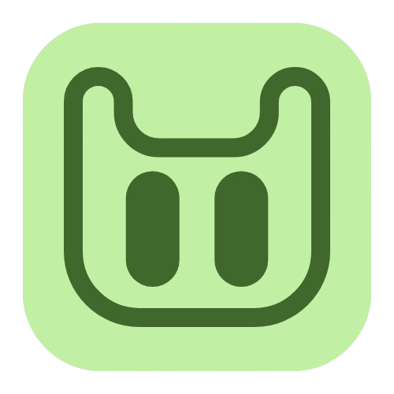
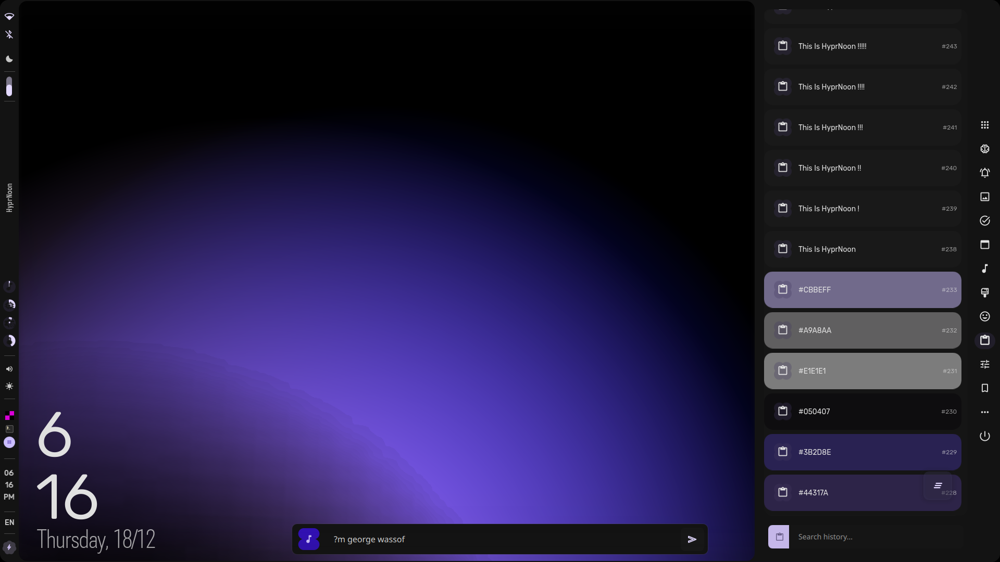
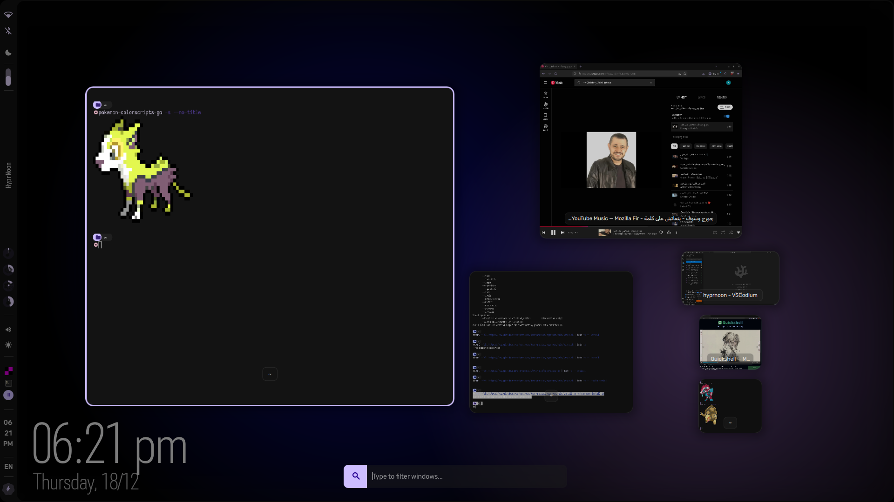
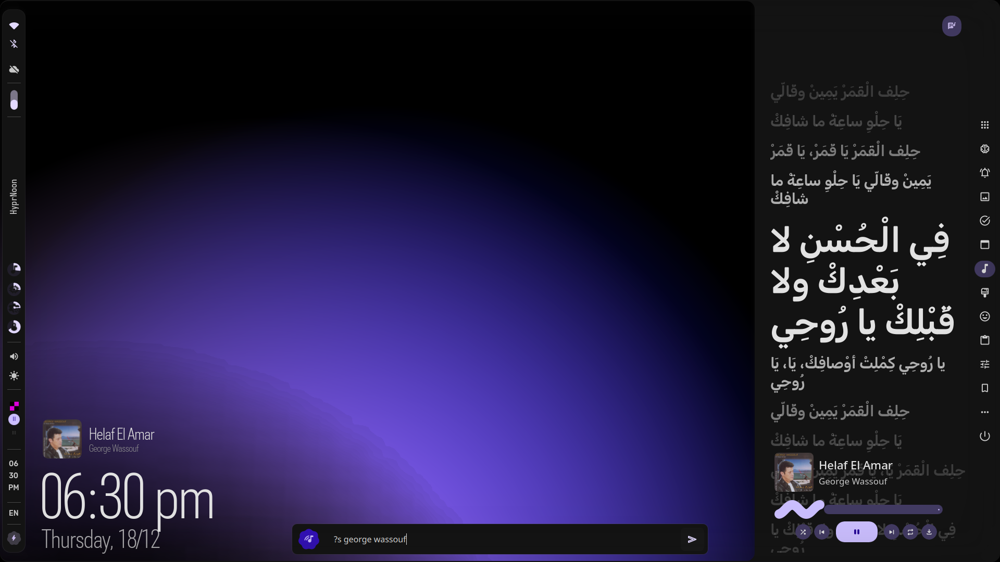
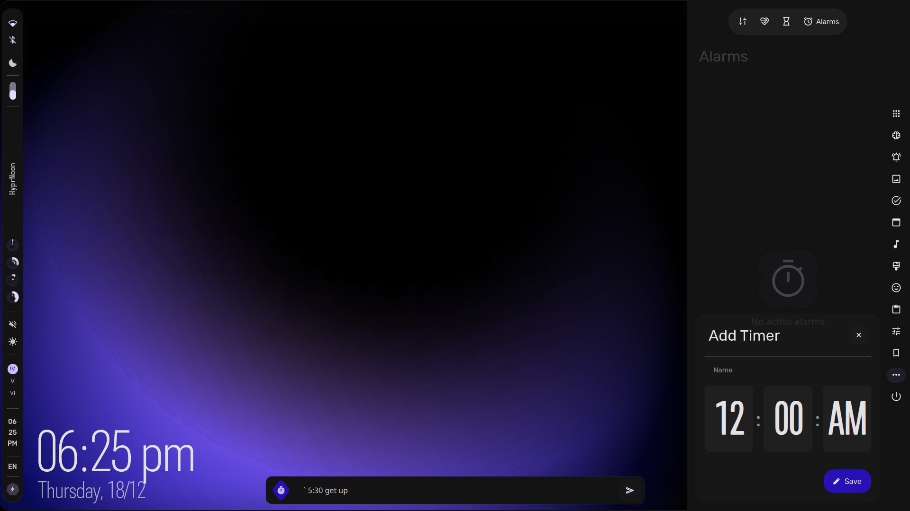

<p align="center">
  
</p>

<h1 align="center">NOON</h1>

### PharmaRacist Prespictive of a Hyprland desktop  

- qt6
- quickshell
- hyprland ofc

### Install

```bash
  # Install noon-main from the aur 
  noon-main install
  # for new nvidia patches
  install noon-nvidia package 
  # for legacy nvidia
  install noon-nvidia-legacy package
```
checkout more noon packages at 
```
yay noon-
```
## Some Screenshots

 
 



## Im too lazy to list the capabilities, So u will figure it out :)
# Enjoy <3
