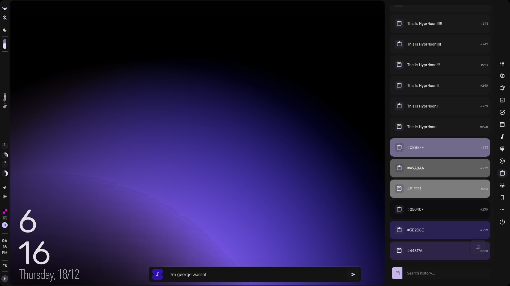
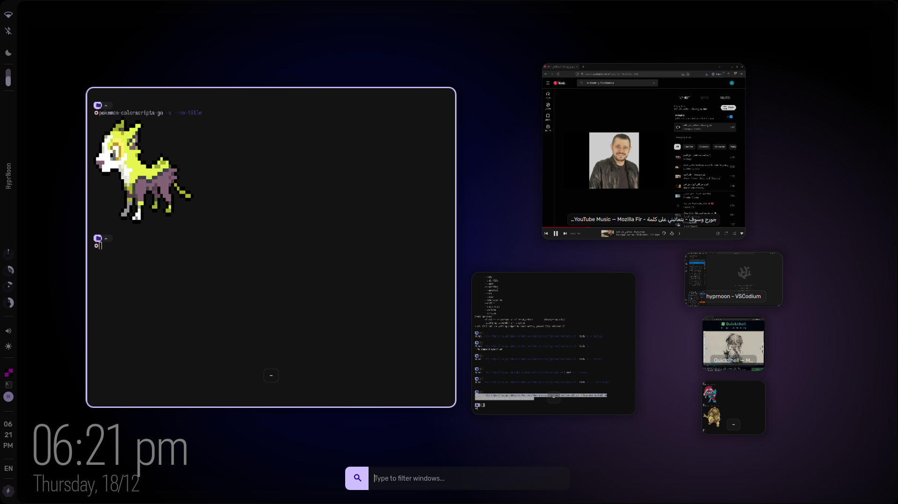
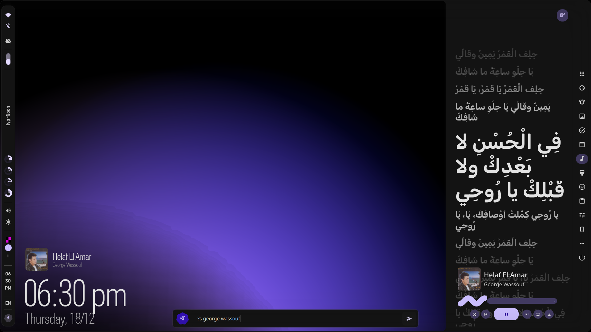
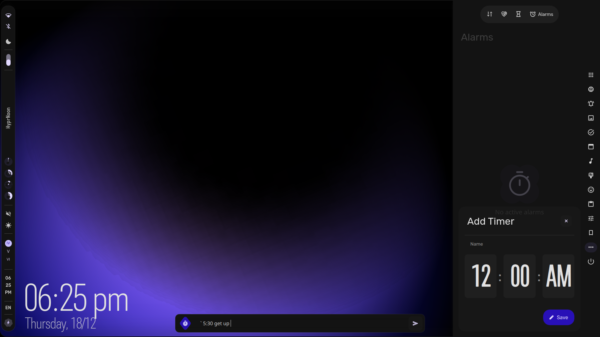

<p align="center">
  
</p>

<h1 align="center">NOON</h1>

### PharmaRacist Prespictive of a Hyprland desktop  

- qt6
- quickshell
- hyprland ofc

### Install

```bash
  yay -S noon-main && noon-setup

```
### Nvidia Patches 
```bash
  yay -S noon-nvidia 
  # for legacy nvidia
  yay -S noon-nvidia-legacy

```

checkout more noon packages at 

```bash
  yay noon-
```

## Some Screenshots

 
 



## Im too lazy to list the capabilities, So u will figure it out :)
# Enjoy <3
